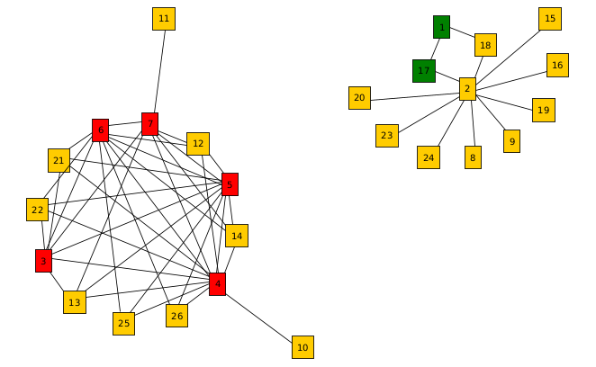

# Max Clique Problem - MiniZinc Model

This project contains a MiniZinc model designed to solve the **Max Clique Problem** with a specific variation:

**"Can you find two disjoint cliques such that the overall number of selected clique nodes is maximized?"**

The project is structured as follows:

## Project Structure

```
.
├── data
│   ├── 26_nodes.dzn
│   ├── 26_nodes.txt
│   ├── 50_edges.txt
│   ├── 5_nodes.dzn
│   └── 5_nodes.txt
├── data_convert.py
├── data_graph.py
├── data_renumber.py
├── double_max_clique.mzn
├── graph
│   ├── 26_nodes.graphml
│   ├── 26_nodes.xlsx
│   ├── 5_nodes.graphml
│   └── 5_nodes.xlsx
├── images
│   ├── 26_nodes.png
│   └── 5_nodes.png
├── LICENSE
├── max_clique.mzn
└── README.md
```

### Files Overview

1. **`data/`**:
   - This folder contains example datasets to feed into the MiniZinc model.
   - **`26_nodes.dzn`**: Example MiniZinc data file containing data for a graph with 26 nodes.
   - **`26_nodes.txt`**: Text file containing an edge list where each line represents an edge in the form "start_node end_node".
   - **`50_edges.txt`**: Text file containing an edge list where each line represents an edge in the form "start_node end_node".
   - **`5_nodes.dzn`**: MiniZinc data file for a graph with 5 nodes.
   - **`5_nodes.txt`**: Text file containing an edge list where each line represents an edge in the form "start_node end_node".

2. **`data_convert.py`**:
   - This Python script converts a text file containing edge lists into a MiniZinc input file (`.dzn` format).
   - The script expects input data in the form:
     ```
     1 2
     1 3
     2 4
     ```
     Where each line represents an edge from a starting node to an ending node.
   - To use the script, run:
     ```
     python3 data_convert.py <input_file> <output_file>
     ```

3. **`data_renumber.py`**:
   - This script renumbers the nodes in an edge list. Given an input file containing edges with nodes in random order, the script reassigns each unique node a progressive number starting from 1. It outputs the renumbered edges to a specified output file.
   - The script expects input data in the form:
     ```
     1 2
     1 3
     2 4
     ```
     Where each line represents an edge from a starting node to an ending node.
   - To use the script, run:
     ```
     python3 data_renumber.py <input_file> <output_file>
     ```

4. **`max_clique.mzn`**:
   - The basic MiniZinc model for solving the Max Clique Problem.
   - You can run the model using:
     ```
     minizinc max_clique.mzn data/26_nodes.dzn
     ```
   - The model finds the largest clique in the given graph.

5. **`double_max_clique.mzn`**:
   - The variation on the Max Clique Problem that focuses on finding two disjoint cliques with the overall maximum number of nodes.
   - You can run the model using:
     ```
     minizinc double_max_clique.mzn data/26_nodes.dzn
     ```
   - The model finds the two disjoint cliques in the given graph.

6. **`data_graph.py`**:
   - This Python script converts an edge list into an undirected adjacency matrix and exports it as an Excel (.xlsx) file for use in graph visualization tools like yEd.
   - To use the script, run:
     ```
     python data_renumber.py <input_file> <output_file>
     ```

7. **`graph/`**:
   - The folder contains graph files in different formats:
     - **`26_nodes.graphml`** and **`5_nodes.graphml`**: GraphML format representation of the graphs.
     - **`26_nodes.xlsx`** and **`5_nodes.xlsx`**: Excel files containing the graph data in tabular form.

8. **`images/`**:
   - The folder contains image representations of the graphs:
     - **`26_nodes.png`**: A visual representation of the graph with 26 nodes.
     - **`5_nodes.png`**: A visual representation of the graph with 5 nodes.

### Example Graph

Here is an example of the graph with 26 nodes:



## Getting Started

To get started with the project, follow these steps:

1. Clone the repository:
   ```
   git clone <repository_url>
   ```

2. Renumber the nodes in the input data:
   ```
   python3 data_renumber.py data/50_edges.txt data/26_nodes.txt
   ```

3. Convert the input data using the Python script:
   ```
   python3 data_convert.py data/26_nodes.txt data/26_nodes.dzn
   ```

4. Run the basic Max Clique model:
   ```
   minizinc max_clique.mzn data/26_nodes.dzn
   ```

5. Run the two max cliques model:
   ```
   minizinc double_max_clique.mzn data/26_nodes.dzn
   ```

## License

This project is licensed under the MIT License - see the [LICENSE](LICENSE) file for details.